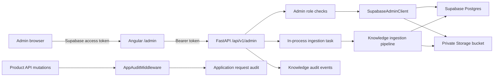

# AstroSpace Admin Console

## Purpose

The AstroSpace Admin Console is the operational control plane for the product.
It is served at `/admin` and provides one authenticated surface for:

- user and account administration;
- product activity and record inspection;
- knowledge source upload and reprocessing;
- passage review, publication, rejection, and retrieval-scope control;
- Context Engine (CE) retrieval testing;
- ingestion-run monitoring;
- administrator access management;
- immutable administrative and application audit history.

The console is not a direct Supabase browser. The Angular client calls protected
FastAPI endpoints, and those endpoints perform privileged Supabase operations
with a backend-only secret.

## Architecture



Primary implementation files:

| Area | File |
| --- | --- |
| Admin API | `astrospace/api/admin_routes.py` |
| Authorization | `astrospace/admin/security.py` |
| Supabase privileged client | `astrospace/admin/client.py` |
| Ingestion job runner | `astrospace/admin/ingestion_jobs.py` |
| Product request audit | `astrospace/admin/audit_middleware.py` |
| Angular console | `ui/src/app/features/admin/` |
| Angular API client | `ui/src/app/core/admin.service.ts` |
| Angular route guard | `ui/src/app/core/admin.guard.ts` |

## Access Model

Console access is stored in `public.admin_users`.

| Capability | Reviewer | Admin |
| --- | :---: | :---: |
| Open console and overview | Yes | Yes |
| Search users and inspect user records | Yes | Yes |
| Inspect product activity and system health | Yes | Yes |
| Inspect sources, chunks, page evidence, and audit history | Yes | Yes |
| Edit passage classification metadata | Yes | Yes |
| Publish, reject, requeue, and bulk-review passages | Yes | Yes |
| Run CE retrieval tests | Yes | Yes |
| Suspend or restore users | No | Yes |
| Grant or revoke console access | No | Yes |
| Edit source-level metadata | No | Yes |
| Upload or reprocess sources | No | Yes |

An `admin_users` row grants access only when `active = true`. The role must be
`admin` or `reviewer`.

### Authorization sequence

1. The Angular guard initializes Supabase authentication.
2. Unauthenticated users are redirected to `/auth`.
3. The guard calls `GET /api/v1/admin/me`.
4. FastAPI validates the user's bearer token.
5. `current_admin` loads the active `admin_users` row.
6. Each full-admin endpoint additionally runs `require_full_admin`.

The Angular guard is navigation assistance, not the security boundary. Every
admin API endpoint enforces authorization on the server.

`ADMIN_EMAILS` can bootstrap full-admin access for listed email addresses. This
is intended for controlled initial setup. Once normal access records exist,
manage authorization through `admin_users`.

In local development, when application authentication is disabled, the current
development user is promoted to the admin role. On Cloud Run this promotion is
refused instead — `current_admin` checks for the `K_SERVICE` env var Cloud Run
sets automatically, and returns 503 rather than granting admin, so a missing
key there fails closed instead of opening the console to anyone.

## Required Configuration

**All three of these are required together.** `SUPABASE_ANON_KEY` is easy to
drop from a copy-paste of this block because the admin console itself doesn't
call it directly — but it's what `SUPABASE_ANON_KEY`-gated app auth (and
therefore the Cloud Run admin refusal above) is keyed on. Deploying with the
service-role key but without the anon key does not narrow the console's
access; it fails auth open instead.

```bash
SUPABASE_URL=https://your-project.supabase.co
SUPABASE_ANON_KEY=your_supabase_anon_key
SUPABASE_SERVICE_ROLE_KEY=...

# SUPABASE_SECRET_KEY may be used instead of SUPABASE_SERVICE_ROLE_KEY.
```

Optional administration settings:

```bash
ADMIN_EMAILS=owner@example.com,second-owner@example.com
ASTROSPACE_DEV_AUTH_BYPASS=true
```

Security requirements:

- Keep service-role and secret keys in backend secrets only.
- Never expose them in Angular environment files, browser code, or mobile apps.
- Never commit real credentials.
- Do not enable `ASTROSPACE_DEV_AUTH_BYPASS` in Cloud Run or another shared
  environment. As of the K_SERVICE check above, setting it there no longer has
  any effect — but treat that as a backstop, not a reason to set it.
- Browser clients continue to use the public Supabase key.

## Console Areas

### Overview

The overview combines:

- total users, recent sign-ins, and users with profiles;
- total profiles, readings, and rated readings;
- knowledge source states;
- passage states;
- CE-retrievable versus excluded passage counts;
- recent sources, ingestion runs, and audit events.

The passage metrics intentionally separate:

- `published`: the reviewer accepted the extracted passage;
- `retrievable`: the passage is both `published` and `core`;
- `excluded`: the passage is preserved but its retrieval scope is not `core`;
- `needs_review`: a person must decide its publication status.

Publication and CE eligibility are separate controls.

### Users

The user list combines Supabase Auth with product records. It supports search by
email, display name, or user ID and reports:

- authentication providers;
- account creation and last sign-in;
- suspension state;
- profile, Ask-thread, and device counts;
- admin/reviewer assignment.

The user inspector includes:

- Supabase Auth metadata;
- `user_profiles` and `user_settings`;
- Kundli/profile records;
- readings and feedback;
- prediction claims;
- Ask threads;
- devices;
- user remedies;
- Muhurta requests.

Only full admins may suspend or restore users. Self-suspension is rejected.
Suspension uses Supabase Auth's ban state. Every action requires a reason and is
written to the knowledge audit log.

### Product Activity

Product Activity summarizes recent:

- readings and ratings;
- prediction validation;
- Ask threads and message counts;
- active remedies;
- Muhurta requests.

This is currently an operational summary, not an analytics warehouse. Endpoint
queries deliberately cap recent collections.

### Knowledge Sources

The source area supports:

- search by title, author, or stable source key;
- filtering by source status;
- per-source counts for published, pending, rejected, CE-core, and excluded
  passages;
- source metadata inspection;
- opening all passages belonging to a source;
- full-admin source metadata corrections;
- full-admin upload and reprocessing.

Source status values are:

- `processing`;
- `ready`;
- `needs_review`;
- `failed`;
- `archived`.

A source key is the stable idempotency key for ingestion. It must contain only
lowercase letters, numbers, and hyphens.

### Source Upload

`POST /api/v1/admin/sources/upload` accepts:

- PDF or EPUB only;
- a normalized source key;
- optional `start_section`;
- optional `max_sections`;
- a maximum file size of 100 MB.

The endpoint:

1. uploads the original file to `astro-knowledge-sources`;
2. writes a queued `knowledge_ingestion_runs` record;
3. writes `source.ingestion_queued` to the audit log;
4. starts an ingestion task;
5. returns the run ID immediately.

PDFs are stored under `pdfs/`; EPUBs are stored under `epubs/`.

### Reprocessing

Reprocessing downloads the preserved source object, creates a new ingestion run,
and executes the same pipeline with the requested section range.

Reprocessing replaces derived sections and chunks for the same `source_key`.
It is the supported way to change immutable extracted evidence or chunk
boundaries. Direct edits to quoted source text are rejected by database
triggers.

### Review Queue

The queue supports filters for:

- publication status;
- retrieval scope;
- source;
- title/content search.

The inspector shows:

- exact extracted passage text;
- title and source identity;
- page labels and section ordinals;
- signed page-image evidence when available;
- source-native domains;
- CE domain mappings;
- subdomains, topics, and content types;
- extraction and classification confidence;
- quality warnings;
- content hash;
- retrieval scope and exclusion reason;
- passage-specific audit history.

Reviewers may change classification metadata but cannot change source text,
hashes, or boundaries.

### Review Actions

| Action | Resulting `quality_status` |
| --- | --- |
| Publish | `published` |
| Reject | `rejected` |
| Requeue | `needs_review` |

Each action requires a reason of at least three characters. Bulk review accepts
up to 100 passage IDs. All events from one bulk action share a request ID, which
makes the operation traceable as one review decision.

After review, the source state is refreshed:

- at least one published passage -> `ready`;
- no published passages -> `needs_review`.

Publishing does not override retrieval scope. A published `navigation` passage
is still unavailable to CE.

### Retrieval Lab

The Retrieval Lab invokes the same `SupabaseSourceRetriever` used by CE. It
accepts:

- a natural-language query;
- zero or more validated CE domains;
- a result limit from 1 to 20.

Results include exact passage text, source and edition, page labels, domain
metadata, lexical score, and semantic score. The lab is the release check for
questions such as:

- Does this query retrieve the expected book and passage?
- Are excluded prefaces, indexes, and catalogues absent?
- Is the domain mapping too broad or too narrow?
- Are source citations sufficient for an agent response?

### Audit Log

The console merges two audit streams.

`knowledge_audit_log` records explicit administrative decisions:

- access changes;
- account suspension/restoration;
- source ingestion and reprocessing;
- source and passage metadata changes;
- publication review;
- retrieval-scope classification.

`app_request_audit_log` records non-admin mutating product API requests:

- method and route;
- actor identity, when available;
- response status;
- resource type and resource ID, when recognized;
- request ID;
- duration;
- a bounded query-string snapshot.

Both tables have update/delete prevention triggers. Knowledge mutations preserve
before and after states. Bulk actions share request IDs.

The application-request audit is deliberately best-effort: audit-storage failure
does not break the user's primary product request. It is therefore useful for
operations and traceability, but it is not a transactional ledger.

### System Health

System Health reports:

- Supabase table counts for major product and knowledge records;
- knowledge storage bucket name;
- CE taxonomy version;
- recent ingestion runs;
- failed-run count;
- an overall `healthy` or `attention` status.

The status currently reflects ingestion-run failures. It does not yet perform
active dependency probes for OCR, LLM providers, storage latency, or CE search
quality.

## API Reference

All routes use the `/api/v1/admin` prefix.

| Method and route | Minimum role | Purpose |
| --- | --- | --- |
| `GET /me` | Reviewer | Current admin identity and role |
| `GET /overview` | Reviewer | Console summary |
| `GET /users` | Reviewer | Search and list users |
| `GET /users/{id}` | Reviewer | Inspect one user |
| `POST /users/{id}/status` | Admin | Suspend or restore account |
| `GET /activity` | Reviewer | Recent product activity |
| `GET /system` | Reviewer | Counts and ingestion health |
| `GET /sources` | Reviewer | Search and list sources |
| `GET /sources/{id}` | Reviewer | Source, sections, chunks, runs |
| `PATCH /sources/{id}` | Admin | Correct source metadata |
| `POST /sources/upload` | Admin | Upload and queue ingestion |
| `POST /sources/{id}/reprocess` | Admin | Reprocess preserved source |
| `GET /chunks` | Reviewer | Filter review passages |
| `GET /chunks/{id}` | Reviewer | Passage, evidence, and audit |
| `PATCH /chunks/{id}/metadata` | Reviewer | Update classification metadata |
| `POST /chunks/{id}/review` | Reviewer | Publish, reject, or requeue |
| `POST /chunks/bulk-review` | Reviewer | Review up to 100 passages |
| `POST /retrieval/test` | Reviewer | Run production-equivalent retrieval |
| `GET /taxonomy` | Reviewer | Current CE taxonomy |
| `GET /audit` | Reviewer | Filter merged audit history |
| `GET /access` | Admin | List console assignments |
| `PUT /access/{id}` | Admin | Grant, change, or revoke access |

## Supabase Objects

| Object | Responsibility |
| --- | --- |
| `admin_users` | Console role and active state |
| `knowledge_ingestion_runs` | Queue/run lifecycle and counts |
| `knowledge_audit_log` | Append-only admin decisions |
| `app_request_audit_log` | Append-only product mutation events |
| `knowledge_sources` | Canonical source identity and file provenance |
| `knowledge_sections` | Page/section evidence |
| `knowledge_chunks` | Reviewable and retrievable passages |
| `astro-knowledge-sources` | Private source, OCR archive, and page-image storage |

The migrations that build the console and its audit controls are:

- `20260726010000_create_knowledge_admin_console.sql`;
- `20260726020000_create_global_admin_audit.sql`;
- `20260726030000_create_pdf_knowledge_provenance.sql`;
- `20260726031000_allow_knowledge_page_images.sql`;
- `20260726032000_allow_knowledge_ocr_archives.sql`;
- `20260726033000_archive_knowledge_sources.sql`;
- `20260726034000_fix_knowledge_immutability_triggers.sql`;
- `20260726035000_add_knowledge_retrieval_scope.sql`.

## Operational Runbook

### Add the first administrator

1. Create or sign in with a normal Supabase Auth account.
2. Temporarily set its email in `ADMIN_EMAILS`, or insert its user UUID into
   `admin_users` with role `admin`.
3. Open `/admin`.
4. Use access management for subsequent administrators and reviewers.
5. Remove temporary bootstrap configuration when it is no longer required.

### Ingest a source

1. Confirm the source is legally usable and bibliographic metadata is known.
2. Prefer the best page-faithful PDF or a structured OCR export.
3. Upload from Knowledge Sources with a stable source key.
4. Monitor the run in System Health.
5. Open the source and inspect confidence, warnings, and page evidence.
6. Resolve the review queue with case-specific reasons.
7. Verify retrieval with realistic CE questions.
8. Record any edition-specific scope boundary in code before broad publication.

### Resolve a failed run

1. Open System Health and read `error_message`.
2. Confirm provider credentials and storage access.
3. Verify the source file and requested section range.
4. Fix the cause in the extractor, analyzer, or environment.
5. Reprocess the preserved source.
6. Confirm the replacement sections and chunks before publication.

### Correct a bad passage

- Incorrect metadata: edit metadata in the passage inspector and state why.
- Incorrect quality decision: publish, reject, or requeue with a reason.
- Incorrect retrieval scope: update the scope and exclusion reason.
- Incorrect OCR text or boundary: do not edit the quotation; repair the source
  pipeline and re-ingest.

## Tests and Validation

Focused backend tests:

```bash
.venv/bin/python -m pytest \
  tests/test_admin_client.py \
  tests/test_knowledge_ingestion.py \
  tests/test_knowledge_scope.py -q
```

Production frontend build:

```bash
cd ui
npm run build
```

Migration comparison:

```bash
supabase migration list --linked
```

Before release, also verify:

- unauthenticated `/admin` navigation redirects correctly;
- a normal authenticated user receives `403` from admin APIs;
- reviewers cannot execute full-admin endpoints;
- self-suspension and self-access removal are rejected;
- passage text cannot be updated directly;
- bulk actions create one shared request ID;
- Retrieval Lab returns only `published` and `core` passages;
- signed page evidence expires and the storage bucket remains private.

## Current Limitations

- Background ingestion runs inside the FastAPI process. A process restart can
  interrupt a run; a durable task queue is the next production step.
- The product activity area is operational inspection, not longitudinal
  analytics.
- Application request auditing is best-effort and not transactionally coupled
  to product writes.
- Audit metadata currently retains a bounded query string. Sensitive product
  parameters should not be placed in URLs.
- System Health does not yet probe every external provider.
- Source deletion and legal-retention workflows are not exposed in the UI.
- Reviewer publication policy is enforced by role, reason, and audit history;
  multi-person approval is not yet implemented.

For the source pipeline and CE retrieval contract, see
[`knowledge_ingestion.md`](knowledge_ingestion.md).
