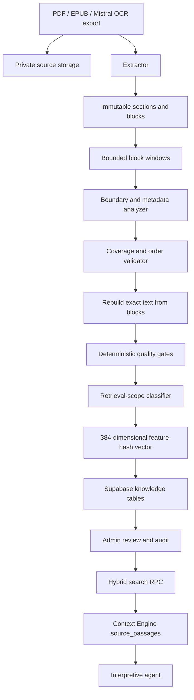

# AstroSpace Knowledge Base Engine

## Purpose

The Knowledge Base (KB) engine converts classical astrology books into
page-verifiable source passages that the Context Engine (CE) can retrieve and
pass to downstream agents.

Its primary guarantees are:

1. Stored quotations come from extracted source blocks, not generated prose.
2. Every passage retains source, page, section, hash, and extraction provenance.
3. LLMs may organize and classify evidence but may not rewrite it.
4. Publication and CE retrieval eligibility are separate decisions.
5. Prefaces, indexes, advertisements, and unrelated content remain preserved but
   can be excluded from retrieval.
6. CE can continue operating if source-corpus retrieval is temporarily
   unavailable.

## Two Knowledge Layers

AstroSpace currently has two complementary knowledge layers.

### Structured rule references

`astrospace/context/references.json` contains concise, curated rule statements
with source locations and verification status. `JsonKnowledgeBase` retrieves
these by CE domain, subdomain, and tags.

These appear in a CE bundle as `references`.

### Verbatim source corpus

Supabase stores extracted passages from PDFs, EPUBs, and Mistral OCR exports.
Search is hybrid lexical/vector retrieval with publication and scope gates.

These appear in a CE bundle as `source_passages`.

The structured layer gives stable machine-readable rules. The source corpus
gives fuller quotations, translations, commentary, examples, and citations.
Neither replaces deterministic astrology calculations in the CE.

## End-to-End Architecture



Primary implementation files:

| Area | File |
| --- | --- |
| Pipeline | `astrospace/knowledge/ingestion/pipeline.py` |
| Data models | `astrospace/knowledge/ingestion/models.py` |
| EPUB extraction | `astrospace/knowledge/ingestion/epub.py` |
| PDF extraction | `astrospace/knowledge/ingestion/pdf.py` |
| Mistral export extraction | `astrospace/knowledge/ingestion/mistral.py` |
| Boundary analyzers | `astrospace/knowledge/ingestion/analyzer.py` |
| Retrieval-scope policy | `astrospace/knowledge/ingestion/scope.py` |
| Embeddings | `astrospace/knowledge/ingestion/embeddings.py` |
| Persistence | `astrospace/knowledge/ingestion/repository.py` |
| CE source retrieval | `astrospace/context/source_retriever.py` |
| CE integration | `astrospace/context/assembler.py` |
| Mistral import script | `scripts/ingest_mistral_exports.py` |
| Existing-corpus classifier | `scripts/classify_knowledge_scope.py` |

## Canonical Inputs

### PDF

PDF is preferred when it provides the best page-verifiable edition. The
extractor uses Poppler's `pdftotext` and `pdftoppm`.

For each selected page it preserves:

- extracted text;
- page label and ordinal;
- JPEG page image;
- text hash;
- page-image hash;
- extraction method;
- extraction confidence and warnings.

The PDF text layer may be damaged even when a page looks correct, especially for
Sanskrit and legacy fonts. Therefore passages produced directly from the PDF
text layer receive a human-verification warning and do not auto-publish.

### EPUB

EPUB is useful when it contains clean born-digital text. The extractor:

- follows the EPUB spine order;
- parses block-level XHTML;
- preserves raw XHTML hashes;
- generates stable block IDs;
- retains section and page metadata when present.

EPUB does not automatically provide a scanned-page visual reference, so edition
and location verification remain important.

### Mistral OCR export

The supported playground export contains:

```text
ocr-playground-download-.../
  <document>/
    pages/
      page-0/
        markdown.md
        page-metadata.json
      page-1/
        markdown.md
        page-metadata.json
```

The importer stores:

- the original PDF;
- a ZIP archive of the raw OCR export;
- the exact Markdown-derived text;
- Mistral page metadata and confidence;
- page ordinals and labels;
- provenance hashes.

This is currently the preferred path for scanned Sanskrit-heavy documents when
Mistral produces materially better OCR than the PDF text layer.

## Storage Layout

The private Supabase bucket is `astro-knowledge-sources`.

Common object paths:

```text
pdfs/<source-key>.pdf
epubs/<source-key>.epub
ocr/mistral/<source-key>/ocr-export.zip
pages/<source-key>/page-<number>.jpg
```

Allowed MIME types include:

- `application/pdf`;
- `application/epub+zip`;
- `application/zip`;
- `image/jpeg`.

The browser never receives the storage secret. Admin passage inspection obtains
short-lived signed page-image URLs from the backend.

## Data Model

### `knowledge_sources`

One row identifies one canonical ingested edition.

Important fields:

- `source_key`: stable unique ingestion identity;
- `title`, `author`, `edition`, `language`;
- `file_type`;
- `storage_bucket`, `storage_path`;
- source file `sha256`;
- `parser_version`;
- source `status`;
- extractor/provider metadata.

Reusing a source key replaces its derived sections and chunks. This makes
ingestion idempotent for one edition.

### `knowledge_sections`

One row represents an extracted page or EPUB section.

Important fields:

- source and ordinal;
- href and title;
- page label;
- `exact_text`;
- text and raw-XHTML hashes;
- extraction confidence;
- page-image path and hash;
- extraction method;
- extraction metadata.

The database prevents changes to extracted text and evidence hashes. A
correction requires re-ingestion.

### `knowledge_chunks`

One row is a reviewable and retrievable passage.

Provenance:

- `source_id`;
- ordinal;
- exact `content`;
- content hash;
- start and end block IDs;
- section ordinals;
- page labels.

Classification:

- source-native domains;
- CE domains and subdomains;
- topics;
- content types;
- classification confidence.

Quality:

- extraction confidence;
- `published`, `needs_review`, or `rejected`;
- quality notes.

Retrieval policy:

- retrieval scope;
- exclusion reason;
- scope confidence;
- scope classifier version.

Search:

- generated English `tsvector`;
- 384-dimensional vector;
- embedding provider.

Chunk content, content hash, and block boundaries are immutable. Reviewers may
correct metadata and state without rewriting the quotation.

### `knowledge_ingestion_runs`

Tracks:

- queued, running, completed, or failed state;
- source key and eventual source ID;
- requester;
- analyzer model;
- section range;
- section/chunk/publication counts;
- start and completion timestamps;
- bounded error message.

### Audit tables

`knowledge_audit_log` records source and passage decisions. It is append-only.
See [`admin_console.md`](admin_console.md) for the full audit contract.

## Extraction and Block Identity

Extractors return a common `EpubBook` model even for PDF and Mistral inputs. The
name reflects the original implementation, not a restriction on file type.

The hierarchy is:

```text
EpubBook
  -> EpubSection
       -> TextBlock
  -> KnowledgeChunk
```

Each `TextBlock` carries:

- stable ID;
- section ordinal;
- block ordinal;
- source href;
- tag/type;
- exact text;
- page label;
- extraction confidence;
- quality notes.

Chunk plans refer only to start and end block IDs. The model never returns final
passage text.

## Analyzer Modes

### Anthropic boundary analyzer

Ordinary Admin PDF/EPUB ingestion uses `AnthropicChunkAnalyzer`, configured by:

```bash
ANTHROPIC_API_KEY=...
KNOWLEDGE_INGESTION_MODEL=claude-opus-5
```

The analyzer receives:

- block IDs and ordered text;
- page and section metadata;
- the current CE domain catalog;
- a strict JSON output schema.

It returns:

- start/end block IDs;
- a short title;
- unrestricted source-native domains;
- optional CE domain/subdomain mappings;
- topics and content types;
- confidence;
- OCR or continuity warnings.

Its system instruction explicitly prohibits quoting, rewriting, correcting,
summarizing, or generating source text.

### Structured OCR analyzer

The five imported Mistral books used `AutomatedChunkAnalyzer`. This deterministic
analyzer:

- splits on headings and maximum size;
- derives source-native domains from headings or salient terms;
- maps CE domains by taxonomy keywords;
- applies OCR corruption and Sanskrit uncertainty checks;
- emits classification confidence and warnings.

It does not call an LLM.

### Heuristic fallback

`HeuristicChunkAnalyzer` is used for tests, local fallback, or invalid analyzer
coverage. It emits low confidence and the warning:

```text
heuristic classification; LLM review required
```

Its output cannot auto-publish.

## Dynamic Domains and CE Domains

The engine keeps two domain layers.

### `source_domains`

These are unrestricted, snake-case labels discovered from the source, such as:

- `planetary_strength`;
- `gulika_calculation`;
- `marriage_timing`;
- `nakshatra_results`.

They preserve the book's subject structure and are not constrained by the
product taxonomy.

### `domains`

These are optional mappings to stable CE routing domains from
`astrospace/context/taxonomy.json`.

A passage may:

- have several source-native domains;
- map to one or more CE domains;
- remain unmapped when there is no defensible CE relationship.

The Admin API rejects unknown CE domain IDs. Dynamic source domains remain
editable and are not forced into a fixed list.

## Chunk Construction

The pipeline processes blocks in bounded windows.

Default limits:

- 16,000 characters;
- 12 blocks.

The Mistral import uses up to 40 blocks per window while retaining the same
character limit.

For every analyzer response, the validator requires:

1. every start/end block ID exists;
2. chunks are ordered;
3. the first chunk starts at the first block;
4. each next chunk starts at the next unconsumed block;
5. no overlap occurs;
6. all blocks are consumed exactly once.

If validation fails, the entire window falls back to heuristic planning and
requires review.

Passage content is then reconstructed with:

```python
"\n\n".join(block.text for block in selected_blocks)
```

This is the central fidelity guarantee: analyzers choose ranges, while the
pipeline controls the stored quotation.

## Quality Gates

The pipeline derives the minimum extraction confidence across selected blocks
and collects all analyzer and extractor warnings.

A passage auto-publishes only when:

- every selected block is present in the reconstructed passage;
- classification confidence is at least `0.70`;
- no quality note exists;
- extraction confidence is absent or acceptable;
- it is not selected for the automated audit sample.

Additional behavior:

- an embedding with no signal creates a warning, so a passage that cannot be
  found semantically is never published unreviewed;
- extraction confidence below `0.90` creates a warning;
- PDF text-layer evidence always creates a human-verification warning;
- heuristic output always creates a review warning;
- Mistral passages use a deterministic 2% sample based on content hash;
- concentrated Sanskrit uncertainty or OCR corruption creates a warning.

Because any warning blocks automatic publication, the practical OCR threshold
for clean structured OCR is `0.90`.

Quality status values:

| Status | Meaning |
| --- | --- |
| `published` | Text passed automation or was accepted by a reviewer |
| `needs_review` | A warning, low confidence, sample, or manual decision remains |
| `rejected` | Passage must not be used in retrieval |

Publication says the passage is acceptable evidence. It does not say the
passage is relevant to CE.

## Retrieval Scope

Every chunk has one scope:

| Scope | Meaning | CE eligible |
| --- | --- | :---: |
| `core` | Astrology rules, translation, commentary, examples, exceptions | Yes |
| `editorial` | Preface, foreword, translator/editor notes, historical framing | No |
| `navigation` | Contents, index, cross-reference-only material | No |
| `publishing` | Title/catalogue/advertisement/subscription material | No |
| `devotional` | Devotional material without an astrology rule | No |
| `out_of_domain` | Material outside AstroSpace astrology domains | No |

The classifier uses:

1. curated ordinal boundaries for known editions;
2. conservative structural markers for unknown editions;
3. `core` as the default when exclusion is not sufficiently certain.

Known-edition boundaries are deliberate because generic keywords can split a
mixed page incorrectly. Boundary passages containing both navigation and an
astrology rule are kept `core` when needed to preserve source meaning.

The scope decision stores:

- scope;
- reason;
- confidence;
- classifier version.

Reviewers can reverse the decision in Admin without changing source text.

### Current corpus cleanup baseline

After classifying the five Mistral editions:

| Scope | Passages |
| --- | ---: |
| Core | 1,199 |
| Navigation/index | 175 |
| Publishing | 14 |
| Editorial | 13 |
| Out of domain | 37 |
| Total | 1,438 |

The 239 excluded passages remain preserved and auditable. They are not deleted
and are not returned by CE retrieval.

## Embeddings and Search

### Current vector

`FeatureHashEmbedder` creates a dependency-free 384-dimensional normalized
feature-hash vector from alphanumeric tokens.

Provider name:

```text
feature-hash-v1
```

This gives deterministic, inexpensive token-level similarity. It is not a
multilingual neural embedding model and should not be described as deep semantic
understanding.

### Hybrid ranking

The Supabase RPC combines:

- PostgreSQL full-text lexical rank: 55%;
- vector cosine similarity: 45%.

The RPC clamps result limits and returns passage text plus citation metadata and
both component scores.

### Zero-magnitude vectors

A passage containing no Latin-alphabet token — a Devanagari-only verse, or table
debris with no words — produces an all-zero vector. Cosine distance against it
is undefined, so pgvector returns NaN, and PostgreSQL orders NaN *above* every
real value. Twelve such chunks were enough to occupy the top of every ranked
search in the corpus.

The guard therefore lives in SQL, in `search_knowledge_chunks` and in the direct
PostgreSQL retriever's query. Clamping the score in Python cannot fix ranking:
`order by` and `limit` have already run in the database, so the genuine matches
were discarded before any client saw them. The Python retrievers still coerce
non-finite scores to zero, but that is defence in depth against JSON encoding,
not the ranking fix.

Ingestion now refuses to publish these silently. `FeatureHashEmbedder` returns a
zero vector when no token hashes, `is_degenerate()` reports it, and the pipeline
raises the quality note `no embedding signal` — which the existing gate routes
to `needs_review` for a human decision.

### Mandatory database gates

`search_knowledge_chunks` applies:

```sql
quality_status = 'published'
and retrieval_scope = 'core'
```

When CE domains are provided, the Supabase RPC also requires domain overlap.
The database gate is the authoritative protection; UI filtering alone is never
trusted.

## CE Integration

During `assemble_domain`, CE builds deterministic chart context first:

- houses and lords;
- natural and Jaimini karakas;
- Vargas;
- Yogas and Doshas;
- Dasha relevance;
- Gocharam;
- conventions and exclusions.

It then retrieves:

1. structured `references` from the JSON rule store;
2. verbatim `source_passages` from Supabase.

The source query is:

- the user's question when supplied; otherwise
- the routed domain name and description.

CE requests no more than eight source passages per domain section. Returned
passages include:

- chunk ID;
- source key;
- book and edition;
- passage title and exact content;
- page labels;
- CE and source-native domains;
- topics;
- lexical and semantic scores.

Source retrieval is additive. If it raises an exception, CE returns an empty
`source_passages` list and continues assembling deterministic context. A
knowledge-search outage must not break chart calculations.

Downstream agents should:

- treat CE calculations as authoritative chart facts;
- use source passages as cited interpretive evidence;
- preserve source and page metadata;
- avoid presenting retrieval scores as astrological confidence;
- never infer that an absent passage disproves an astrology rule.

## Repository Selection

`get_source_retriever()` selects:

1. `SupabaseSourceRetriever` when `SUPABASE_URL` and a backend secret exist;
2. direct `PostgresSourceRetriever` for a PostgreSQL `DATABASE_URL`;
3. `NullSourceRetriever` otherwise.

The null retriever allows local CE calculations to run without a configured
source corpus.

## Ingestion Operations

### Admin upload

Use `/admin` for ordinary PDF and EPUB ingestion. Admin uploads use the
Anthropic boundary analyzer and run in the FastAPI process.

### Mistral export import

Place the original PDFs and matching export directory below the knowledge root,
then run:

```bash
SUPABASE_URL=https://your-project.supabase.co \
SUPABASE_SERVICE_ROLE_KEY=... \
.venv/bin/python scripts/ingest_mistral_exports.py \
  --knowledge-root "Astro Space Knowledge Base"
```

Import selected books:

```bash
.venv/bin/python scripts/ingest_mistral_exports.py \
  --knowledge-root "Astro Space Knowledge Base" \
  --only uttara-kalamritam
```

The importer:

1. uploads the original PDF;
2. uploads the OCR export ZIP;
3. creates an ingestion-run record;
4. extracts page blocks and metadata;
5. runs deterministic structured-OCR analysis;
6. replaces the source by source key;
7. records counts and audit history;
8. archives the superseded PDF pilot after a complete import.

### PDF text-layer pilot

```bash
.venv/bin/python -m astrospace.knowledge.ingestion \
  "Astro Space Knowledge Base/PDFs/Uttara kalamritam..pdf" \
  --storage-path pdfs/uttara-kalamritam.pdf \
  --source-key uttara-kalamritam-pdf \
  --start-section 15 \
  --max-sections 20
```

For PDFs, `start-section` is a zero-based page index.

### Reclassify existing retrieval scope

```bash
SUPABASE_URL=https://your-project.supabase.co \
SUPABASE_SERVICE_ROLE_KEY=... \
.venv/bin/python scripts/classify_knowledge_scope.py
```

The script:

- targets Mistral-ingested sources;
- applies versioned scope rules;
- updates only classification fields;
- batches updates;
- writes one summary audit event per changed source;
- prints per-source counts.

It is idempotent for the same classifier version and corpus.

## Review Procedure

For each passage requiring review:

1. Open the source and passage in Admin.
2. Compare exact text with the signed page image or original edition.
3. Verify that Sanskrit, transliteration, translation, and commentary boundaries
   are not accidentally merged or truncated.
4. Check source-native domains.
5. Add CE domains only when the passage supports them.
6. Check retrieval scope independently from publication status.
7. Publish, reject, or requeue with a specific reason.
8. Test representative questions in Retrieval Lab.

Do not manually reconstruct corrupted Sanskrit inside chunk content. Improve OCR
or re-ingest from a better source. A clean book-provided English translation can
be reviewed independently when its source boundary and citation are clear.

## Release Gate

A source passage is available to CE only when all of these are true:

- stored content matches its content hash;
- its content was reconstructed from source blocks;
- source and section provenance exist;
- source evidence is immutable;
- classification confidence meets policy or a reviewer accepts it;
- quality warnings are resolved;
- `quality_status = 'published'`;
- `retrieval_scope = 'core'`;
- the query's CE-domain filter matches when one is supplied.

Recommended corpus-release checks:

- known queries retrieve the expected books and pages;
- preface, contents, index, and publisher text do not retrieve;
- Sanskrit-heavy pages retain readable evidence and page images;
- mixed boundary pages preserve actual astrology content;
- every returned passage can be traced to a source and page;
- repeated ingestion by source key does not create duplicate active editions;
- rejected or requeued chunks disappear from retrieval immediately.

## Supabase Security

Knowledge tables and the private bucket are backend controlled.

- RLS is enabled.
- `anon` and `authenticated` receive no direct table access.
- the search RPC is executable only by `service_role`;
- Admin APIs use the backend secret after authenticating and authorizing the
  requesting user;
- source evidence and audit rows have immutability triggers;
- page images are exposed only through signed URLs.

Agents and mobile/browser clients must never receive the service-role key.

## Tests

Run the focused suite:

```bash
.venv/bin/python -m pytest \
  tests/test_knowledge_ingestion.py \
  tests/test_knowledge_scope.py \
  tests/test_admin_client.py -q
```

Coverage includes:

- exact-source reconstruction;
- analyzer boundary validation and fallback;
- automated quality behavior;
- dynamic source domains;
- known-edition scope counts and boundaries;
- conservative unknown-edition behavior;
- Supabase client behavior.

Database-level retrieval should also be tested after every search migration by
querying the RPC for:

- a known astrology rule;
- a phrase from an index;
- a phrase from publisher material;
- a query with and without CE domain filters.

## Current Limitations and Next Steps

### Current limitations

- The vector is feature hashing, not a multilingual neural embedding. It
  tokenizes on a Latin-initial pattern, so Devanagari text produces no vector
  at all and is unreachable by semantic search; the English `tsvector` does not
  index it either, leaving such passages reachable only by direct inspection.
- PostgreSQL full-text search uses the English text configuration.
- Sanskrit, transliteration, and English are not yet indexed into separate
  language-aware search fields.
- Admin uploads run as in-process background tasks rather than durable jobs.
- Scope rules for the initial five editions include curated ordinal boundaries;
  new editions need validation before broad automatic exclusion.
- The direct PostgreSQL retriever allows unmapped chunks through a domain query,
  while the Supabase RPC requires overlap. Production currently uses Supabase;
  these semantics should be unified.
- There is no cross-encoder reranker.
- Retrieval quality metrics and golden query sets are not yet stored as a
  versioned evaluation suite.
- Multi-reviewer approval is not required for high-risk passages.

### Recommended next steps

1. Move ingestion to a durable Cloud Run job or queue worker.
2. Add multilingual embeddings suitable for English, Sanskrit, and
   transliteration.
3. Add language-aware lexical indexes.
4. Build a versioned golden retrieval suite by CE domain.
5. Add citation precision, exclusion leakage, and recall metrics.
6. Add optional reranking after the database gate.
7. Unify domain-filter semantics across Supabase and direct PostgreSQL.
8. Add edition-level legal status, license, provenance, and retention metadata.
9. Add two-person approval for passages used in sensitive interpretations.
10. Persist retrieval-model and corpus-version metadata with generated readings.

For console operation, roles, routes, and audit behavior, see
[`admin_console.md`](admin_console.md).
